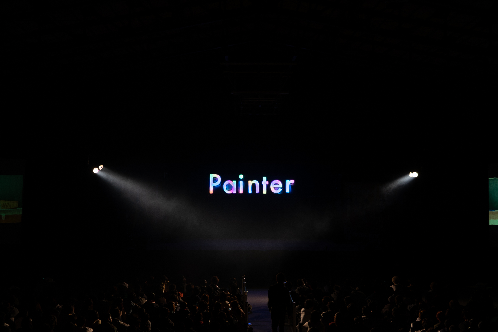
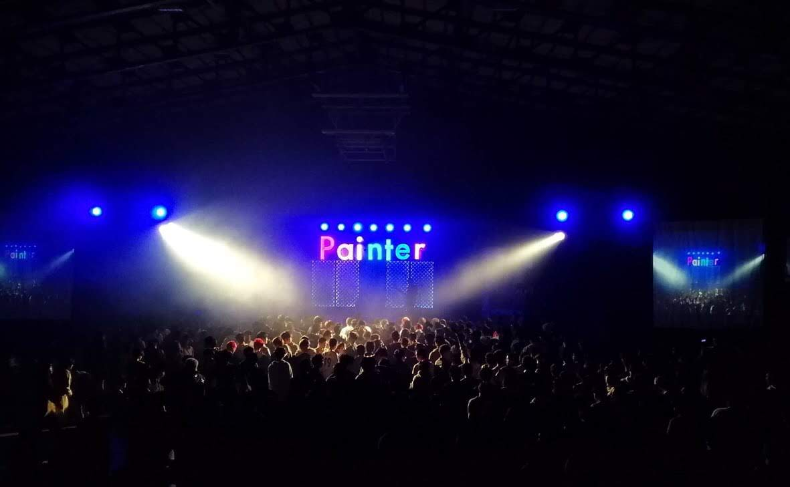

# 2018年ステージバック
## 概要
体育館ステージの奥にある、テーマのライトアップを行う  
WEBアプリケーションを起動してタブレットでリモート操作する

## 使うものとか
- Raspberry Pi 3B+
- [WS2813B LED TAPE](http://akizukidenshi.com/download/ds/worldsemi/WS2813B.pdf)
## 結果
  
  
